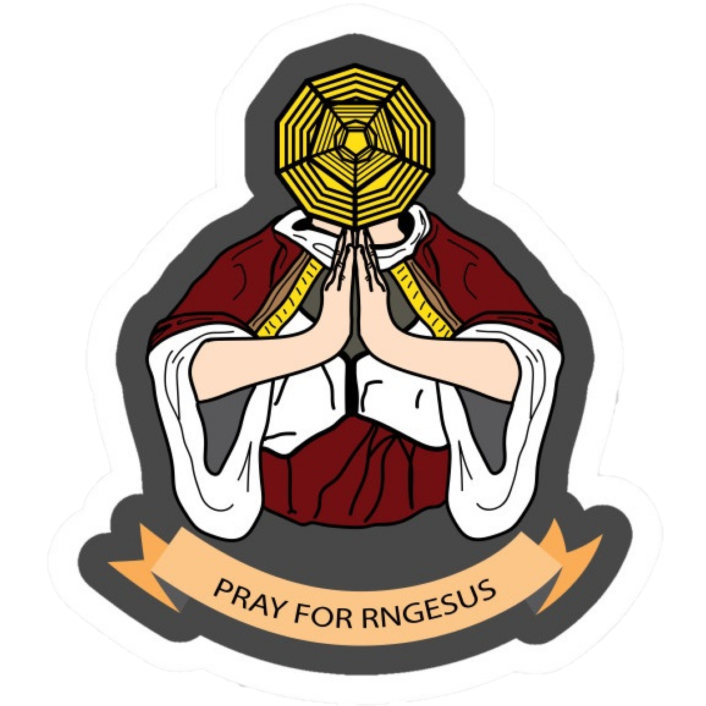

<!-- PROJECT LOGO -->
<br />
<p align="center">
  <a href="https://rngame.github.io/">
    
  </a>

  <h3 align="center">RNGame</h3>

  <p align="center">
    An interactive Random Number Generator visualization
    <br />
    <a href="https://github.com/RNGame/RNGame.github.io/wiki"><strong>Explore the Wiki »</strong></a>
    <br />
    <br />
    <a href="https://rngame.github.io/">Play the Game</a>
    ·
    <a href="https://github.com/RNGame/RNGame.github.io/issues">Report Bug</a>
    ·
    <a href="https://github.com/RNGame/RNGame.github.io/issues">Request Feature</a>
  </p>
</p>


<!-- TABLE OF CONTENTS -->
<details open="open">
  <summary>Table of Contents</summary>
  <ol>
    <li>
      <a href="#about-the-project">About The Project</a>
      <ul>
        <li><a href="#built-with">Built With</a></li>
      </ul>
    </li>
    <li>
      <a href="#getting-started">Getting Started</a>
      <ul>
        <li><a href="#prerequisites">Prerequisites</a></li>
        <li><a href="#installation">Installation</a></li>
      </ul>
    </li>
    <li><a href="#usage">Usage</a></li>
    <li><a href="#contact">Contact</a></li>
    <li><a href="#acknowledgements">Acknowledgements</a></li>
  </ol>
</details>


<!-- ABOUT THE PROJECT -->
## About The Project

[![RNGame Screen Shot][rngame-screenshot]](https://rngame.github.io/)

This project was developed by [Benjamin Jasper](https://github.com/benjasper) and [Marvin Rudolph](https://github.com/MRudi95) as part of their education at the [HTWG Konstanz](https://www.htwg-konstanz.de/).
<br />
The goal was to visualize different random number generators and distributions in an interactive and engaging way >> as a Game.
<br />
<br />
The game **RNGeddon** is a game where the earth is endangered by an ever increasing number of meteors, that the player has to destroy to protect the earth. The direction and speed of these meteors can be controlled with different random number generators such as the 
  * [gaussian distribution](https://en.wikipedia.org/wiki/Normal_distribution)
  * [exponential distribution](https://en.wikipedia.org/wiki/Exponential_distribution)
  * [uniform distribution](https://en.wikipedia.org/wiki/Continuous_uniform_distribution)

The name **RNGeddon** is an homage to the outstanding movie **Armageddon**, where an oil drilling expert played by [Bruce Willis](readme_src/bruce_willis.jpg) and his crew of oil drillers go on to become astronauts and save the world from an asteroid in an heroic feat of self sacrifice.

[![RNGeddon Screen Shot][rngeddon-screenshot]](https://rngame.github.io/rngeddon.html)

### Built With

* [Typescript](https://www.typescriptlang.org/)
* [p5.js](https://p5js.org/)
* [plotly.js](https://plotly.com/)
* [jQuery](https://jquery.com/)
* [webpack](https://webpack.js.org/)

<!-- GETTING STARTED -->
## Getting Started

### Prerequisites

If You have not already, you need to install the Node package manager. You can get the latest version at [npmjs.com](https://www.npmjs.com/get-npm) or update your npm to the latest version.
  ```sh
  npm install npm@latest -g
  ```

### Installation

1. Clone the repo
   ```sh
   git clone https://github.com/RNGame/RNGame.github.io
   ```
2. Install NPM packages
   ```sh
   npm install
   ```
3. Start the local server to run the project
   ```sh
   npm run start
   ```

<!-- USAGE EXAMPLES -->
## Usage

Presentation Video (in german)
[![Watch the Presentation Now][presentation-screenshot]](https://drive.google.com/file/d/10KdPyUA8DFna4NpWuw0gbUs4MWzryxmH/view)

<!-- CONTACT -->
## Contact

Benjamin Jasper - [github](https://github.com/benjasper) - benjamin.jasper@htwg-konstanz.de
<br />
Marvin Rudolph - [github](https://github.com/MRudi95) - marvin.rudolph@htwg-konstanz.de

Project Tutor:
<br />
Prof. Dr. Barbara Staehle - bstaehle@htwg-konstanz.de

Project Link: [github.com/RNGame/RNGame.github.io](https://github.com/RNGame/RNGame.github.io)


<!-- ACKNOWLEDGEMENTS -->
## Acknowledgements
* [GitHub Pages](https://pages.github.com)
* [Prob.js](https://bramp.github.io/prob.js/)
* [Vanta.js](https://www.vantajs.com/)

<!-- MARKDOWN LINKS & IMAGES -->
[rngame-screenshot]: readme_src/rngame_screenshot.PNG
[rngeddon-screenshot]: readme_src/rngeddon_screenshot.PNG
[presentation-screenshot]: readme_src/presentation_screenshot.PNG
[bruce_willis]: readme_src/bruce_willis.jpg
